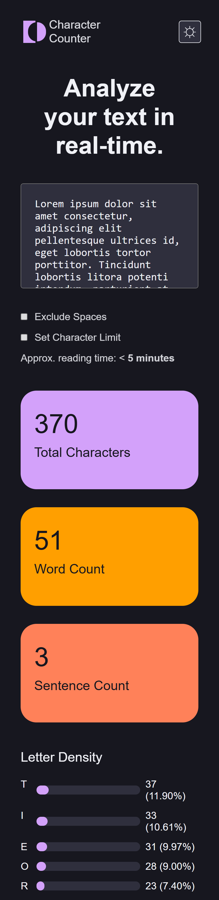
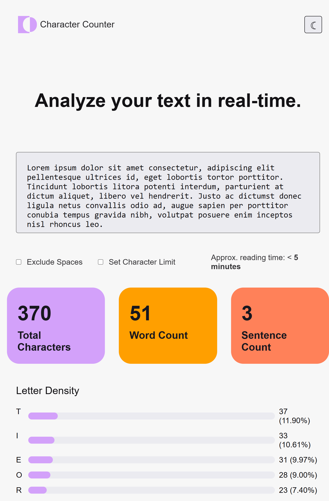
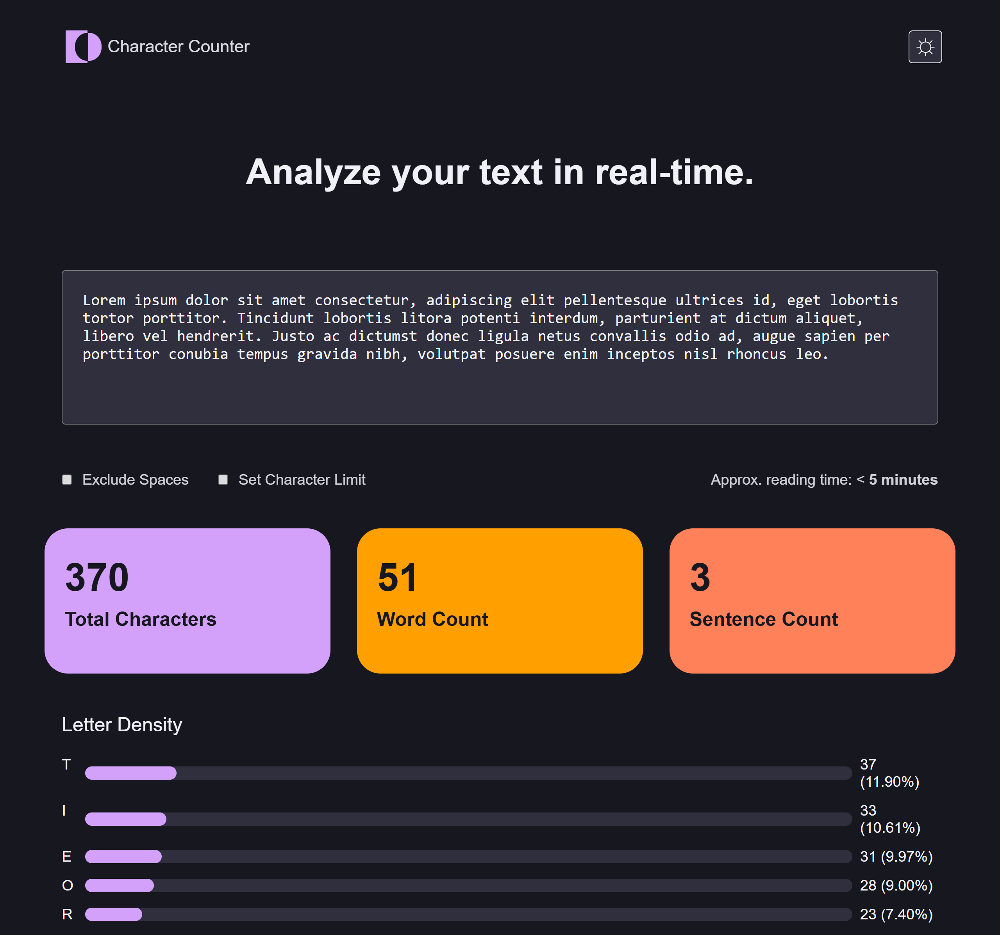

# 📊 TextAnalyzer
**TextAnalyzer** is an interactive web tool that allows users to analyze text in real-time. It provides statistics such as the number of characters, words, sentences, and the density of the most used letters. Additional features include character limit customization and a light/dark mode toggle.

## 🚀 Demo  




## 🛠️ Built With
- **HTML**  
- **CSS**  
- **JavaScript**

## ✨ Features
- Character count (with and without spaces).  
- Word and sentence counter.  
- Top 5 most used letter density.  
- Estimated reading time.  
- Customizable character limit.  
- Light/Dark mode toggle.

## 📁 Installation  
1. Clone the repository:  
   ```bash
   git clone https://github.com/Bricafio/TextAnalyzer.git
   ```
2. Open the `index.html` file in your browser.

## 🧾 License
This project is licensed under the MIT License. Feel free to use, modify, and share it.

## ⚠️ Disclaimer
This project was inspired by a challenge from Frontend Mentor. The current implementation was created from scratch using only the challenge’s visual guidelines as a reference. You can view the original challenge [https://www.frontendmentor.io/challenges/character-counter-znSgeWs_i6](#).

